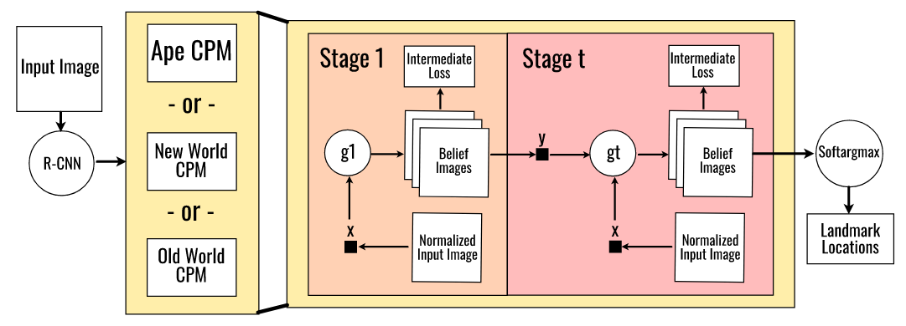

# Primate-Pose-Estimation

This project aims to estimate the pose of non-human primates (monkeys) as part of the [OpenMonkeyChallenge](http://openmonkeychallenge.com). This project was taken up as the final project for CSCI 5561: Computer Vision coursework at the University of Minnesota under the guidance of [Dr. Junaed Sattar](https://cse.umn.edu/cs/junaed-sattar).  

OpenMonkeyChallenge (OMC) is an ongoing computer vision benchmark challenge for NHP (Non-Human Primate) pose tracking.  

## Data

The data for this challenge has been made publicly available by [Yao et. al.](https://www.biorxiv.org/content/10.1101/2021.09.08.459549v1). The data has been collected from various sources including the internet, National Primate Centers, and the Minnesota Zoo which contains a diverse species (26 species) of NHPs. It is a set of 111,529 images annotated with 17 landmarks - Nose, Left eye, Right eye, Head, Neck, Left shoulder, Left elbow, Left wrist, Right shoulder, Right elbow, Right wrist, Hip, Left knee, Left ankle, Right knee, Right ankle, and Tail.  

## Architecture

Our project uses a combined architecture of rCNN and CPMs to classify the species and estimate their pose.  

